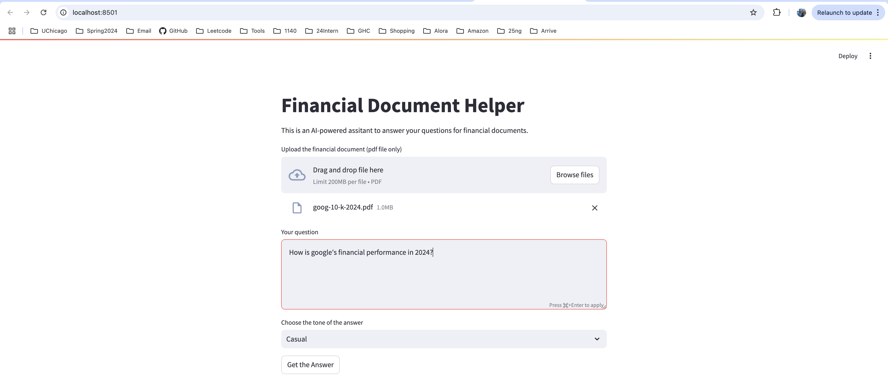

# MPCS57200_proj
## Overview
This project build a Financial Document Helper, where user can upload financial news, companies' annual reports and so on and ask their questions. The helper will find the answers from the documents they uploaded and respond in the desired tone of the user. 

## Instruction
### Set up environment 
Create an .env file in the same directory of app.py. In the .env file, include your OpenAI API Key as 
```
OPENAI_API_KEY={YOUR_OPENAI_API_KEY}
```
### Install packages
Install necessary packages to run the project, including streamlit, langchain, langchain_community, langchain_openai, openai
### Run the project
```
streamlit run app.py 
```
## Implementation
The project utilizes streamlit as its web app development framework. The webUI is built up with file uploader, text input area and a selection list for users to upload the financial document, input their questions and select their desired tone of response that our helper give back. 

When the user upload the file and input their question, they can click "Get the Answer" for the response from our Financial Document Helper. The work behind the scene is that we firstly split the documents into small chuncks and store its embedding into the FAISS vector database. Then we query the database with the user's question and get an answer from the document we have. We then further process the answer with OpanAI api and prompt engineering to make the answer tailored for the user's question and his selected desire tone of response. 
